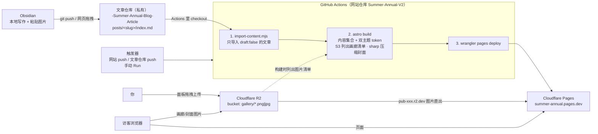

# 网站架构

## 图例说明

- **文章仓库（私有）**：只存文章源文件（md + 图片引用），不含任何站点代码
- **网站仓库（公开）**：Astro 源码 + 构建流水线；构建产物（含文章内容）只存在 dist/，不进仓库
- **R2（图床）**：画廊图片直出，读操作公开、写操作仅凭据
- **触发器**：三条路都会触发完整构建——网站 push、文章仓库 push（notify-site.yml 发 repository_dispatch）、Actions 手动
- **本地开发**：`pnpm dev` 读取 `.env` 里的 R2 凭据，与线上同一套构建逻辑，`localhost:4321` 全功能预览
